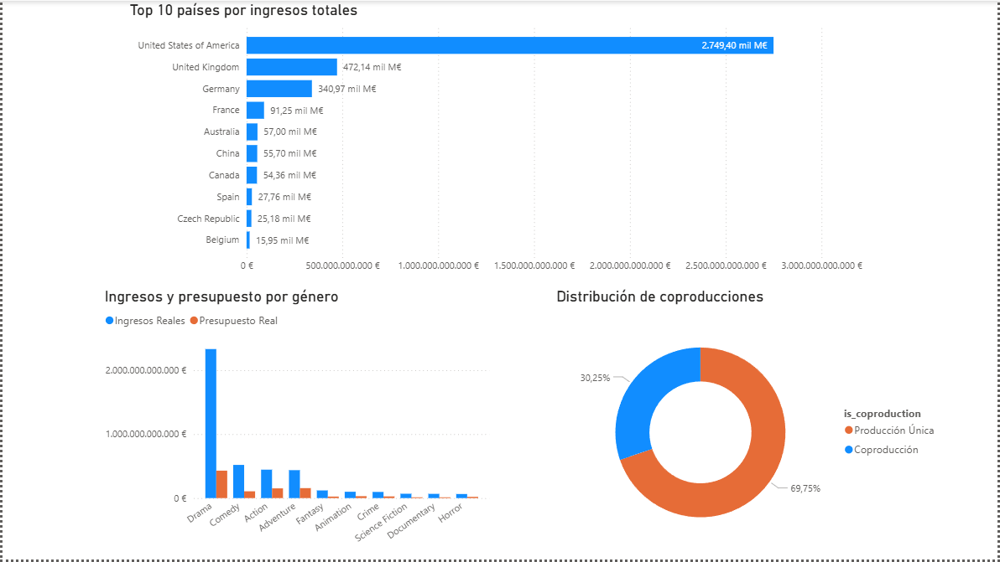
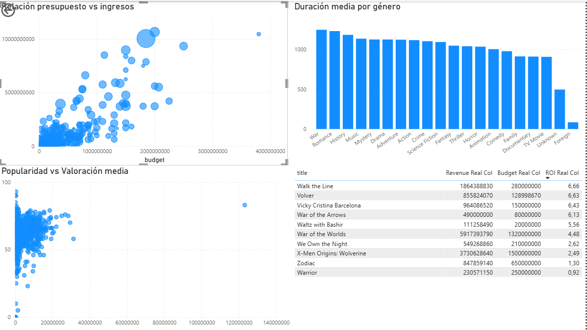

# 🎬 Análisis de Datos del Sector Cinematográfico

## 📖 Descripción del Proyecto
Este proyecto constituye el **Proyecto Final del módulo de Análisis de Datos en Python**.  
Su objetivo es realizar un **análisis exploratorio y estadístico** de un conjunto de datos cinematográficos,  
identificando patrones en la producción, la rentabilidad y las valoraciones del público.  

El análisis busca responder preguntas clave como:
- ¿Qué géneros y países destacan en número de producciones y valoración media?  
- ¿Cómo se relacionan el presupuesto, los ingresos y las valoraciones?  
- ¿Existen diferencias relevantes entre producciones únicas y coproducciones?  

Incluye todo el proceso analítico completo:
- Limpieza y transformación profunda de los datos.  
- Análisis descriptivo, comparativo y estadístico.  
- Visualizaciones interpretativas.  
- Conclusiones globales explicativas.  
- **Dashboard operativo (pendiente de implementación).**

---

## 🗂 Estructura del Proyecto

📁 Proyecto_Final/\
├── data/\
│   ├── dataset_final.zip   # Dataset limpio usado en el análisis\
├── notebooks/\
│ └── Proyecto_Final.ipynb # Notebook principal con el análisis completo\
├── README.md # Descripción del proyecto (este archivo)\

---

## 📂 Fuentes de Datos

Los datos originales utilizados en este proyecto provienen de **[The Movies Dataset (Kaggle)](https://www.kaggle.com/datasets/rounakbanik/the-movies-dataset)**, un conjunto de datos público con información sobre películas, géneros, países de producción, presupuestos, ingresos y valoraciones de usuarios.

De este dataset completo se han empleado específicamente los siguientes archivos para el análisis:

- `movies_metadata.csv` → Contiene información general de las películas (género, idioma, país, presupuesto, ingresos, etc.).  
- `ratings.csv` → Contiene las valoraciones de los usuarios a cada película.

El resto de archivos incluidos en el dataset original no se han utilizado en este proyecto.

Tras la limpieza y transformación de los datos, ambos archivos se integraron en un **dataset final procesado**, disponible en este repositorio bajo el nombre:  
📦 `dataset_final.zip`  

> 💡 Nota: Los datos originales no se incluyen directamente en el repositorio debido a su tamaño, pero pueden descargarse libremente desde el enlace de Kaggle indicado arriba.

---

## 🛠 Instalación y Requisitos

**Lenguaje:** Python 3.13  

**Librerías principales utilizadas:**
- pandas  
- numpy  
- matplotlib  
- seaborn  
- scipy  
- json  

**Para ejecutar el proyecto:**
1. Clonar el repositorio o descargar los archivos.  
2. Abrir el notebook `Proyecto_Final.ipynb` en Jupyter o VS Code.  
3. Ejecutar las celdas en orden para reproducir todo el análisis.  

---

## 📊 Resultados y Conclusiones

### 🔹 Limpieza y Transformación
- Se eliminaron duplicados, nulos y valores inconsistentes.  
- Se transformaron columnas complejas (géneros, países, colecciones) en estructuras normalizadas.  
- Se crearon nuevas variables como `main_country`, `num_countries`, `main_genre`, `ROI`, etc.  
- Se integraron `movies_metadata` y `ratings` en un único dataset limpio.  

### 🔹 Análisis Descriptivo y Exploratorio
- **Ratings:** Distribución centrada en valores intermedios (3–4), lo que refleja valoraciones equilibradas.  
- **Géneros:** Drama, Comedy y Action dominan en volumen, pero **Animation y Documentary** obtienen mejores valoraciones medias.  
- **Países:** EE.UU. lidera en cantidad de producciones, mientras que **Reino Unido, Francia y Alemania** muestran resultados de calidad competitiva.  
- **Presupuesto vs Ingresos:** Existe una correlación positiva; sin embargo, el alto presupuesto no garantiza el éxito.  

### 🔹 Comparativa de Producciones
**Coproducciones vs Producciones Únicas:**
- Ingresos medios: **Producciones únicas ligeramente superiores** (+2.42M, +3.35%).  
- Mediana: **Coproducciones** con valores más altos (18.6M vs 0.17M).  
- ROI: **Producciones únicas más rentables** (3.84 vs 2.19).  
- Diferencia significativa (p < 0.001) en ingresos log-transformados → **producciones únicas superiores**.

**Conclusión global:**  
Las **producciones únicas** son más rentables pero arriesgadas;  
las **coproducciones** son más estables y tienden a asegurar ingresos intermedios.  

---

## 🔄 Próximos Pasos
- Implementar el **Dashboard operativo** para explorar resultados de forma interactiva.  
- Incluir nuevas métricas temporales (evolución por décadas, popularidad anual).  
- Ampliar el análisis con variables de audiencia o sentimiento en reseñas.  

---

## 📊 Dashboard en Power BI

El proyecto incluye un dashboard interactivo desarrollado en **Power BI**, estructurado en tres páginas principales:

### 🔹 Resumen general

Vista global con KPIs clave:

* Total de películas
* Ingresos y presupuesto (corregidos sin duplicados)
* ROI medio
* Valoración media

Incluye:

* Distribución por géneros
* Evolución temporal
* Mapa de ingresos por país

---

### 🔹 Análisis por género y país

Explora patrones estructurales:

* Comparación entre ingresos y presupuesto por género
* Distribución de coproducciones
* Ranking de países por ingresos

---

### 🔹 Rendimiento y popularidad

Análisis avanzado:

* Relación entre presupuesto e ingresos
* Popularidad vs valoración
* Duración media por género
* Top películas por ROI

---

### 📸 Capturas del dashboard

---

### 🔗 Acceso al dashboard

El archivo completo de Power BI puede consultarse aquí:

👉 [Ver dashboard](https://drive.google.com/file/d/18OjmtS4XZVQLZ7MRQ5MSpHdeuWNM7ZcC/view?usp=drive_link)

*Nota: El archivo puede descargarse y abrirse con Power BI Desktop.*

---

## ✒ Autora
**Celia Palacios**  
💻 Proyecto Final   

---

## 🧾 Nota Final
El notebook `Proyecto_Final.ipynb` actúa como **informe explicativo completo**,  
incluyendo la limpieza, análisis, visualización y conclusiones globales.  
